# Architecture Documentation

This document provides visual representations of the system architecture using Mermaid diagrams.

## 📐 System Architecture Diagram

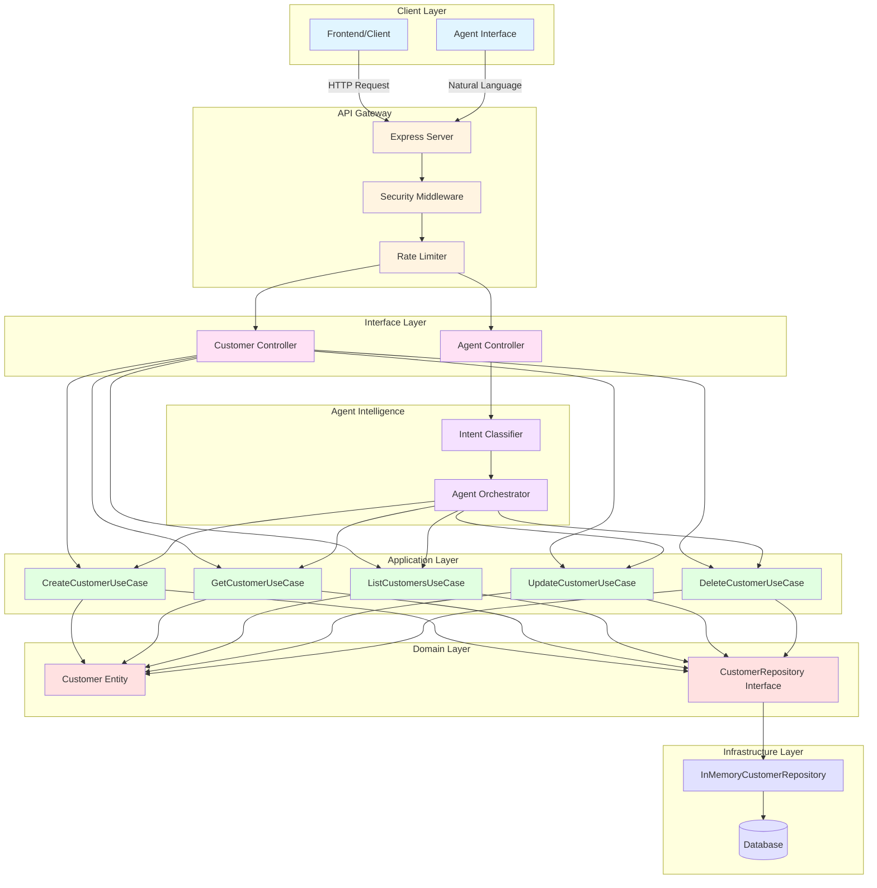

## 🔄 Clean Architecture Layers

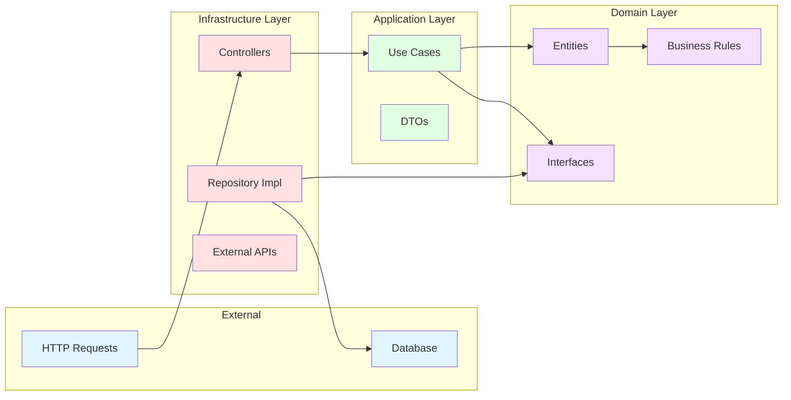

## 📊 Create Customer - Sequence Diagram

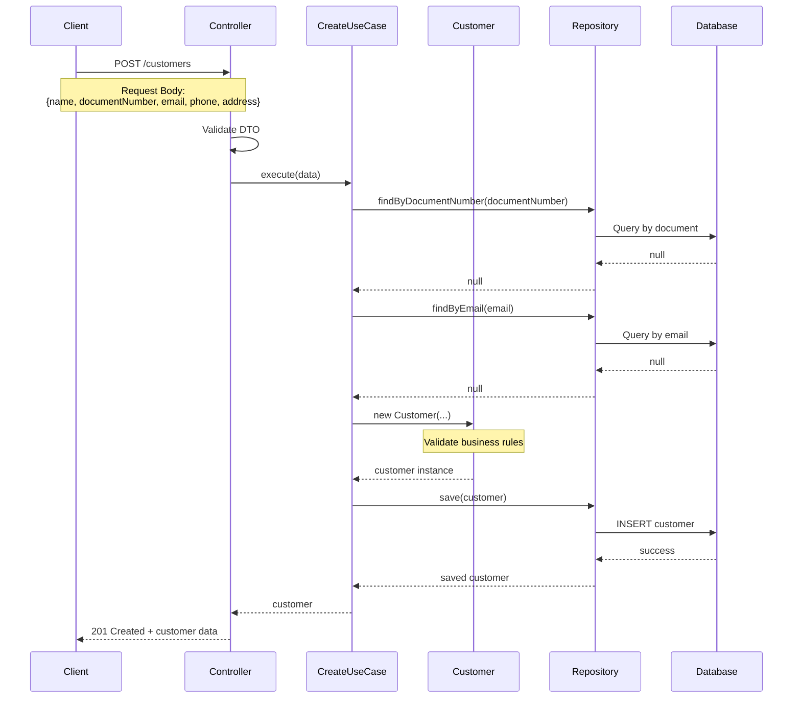

## 🔍 Get Customer - Sequence Diagram

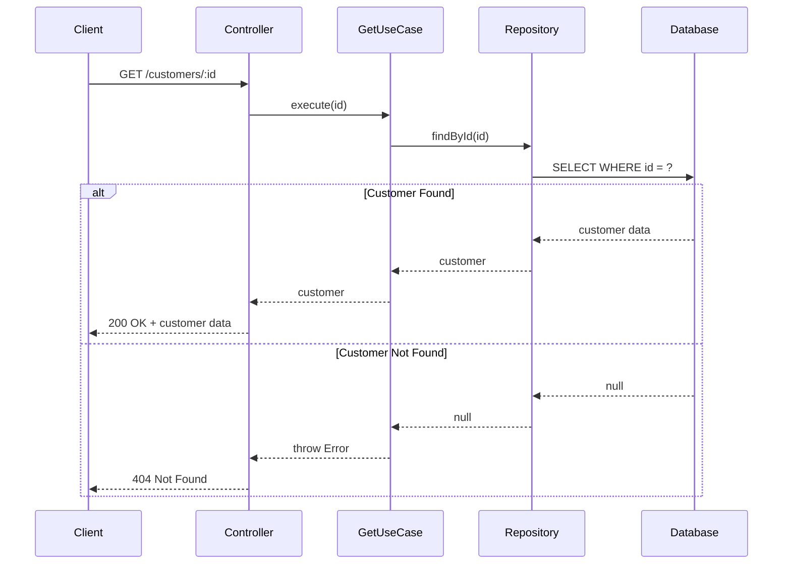

## 📋 List Customers - Sequence Diagram

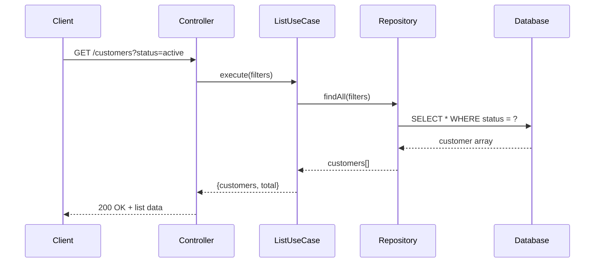

## ✏️ Update Customer - Sequence Diagram

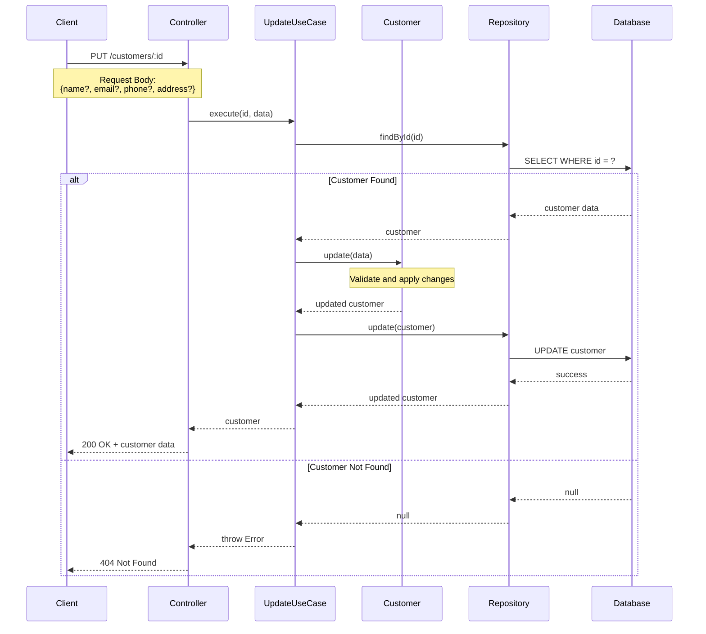

## 🗑️ Delete Customer - Sequence Diagram

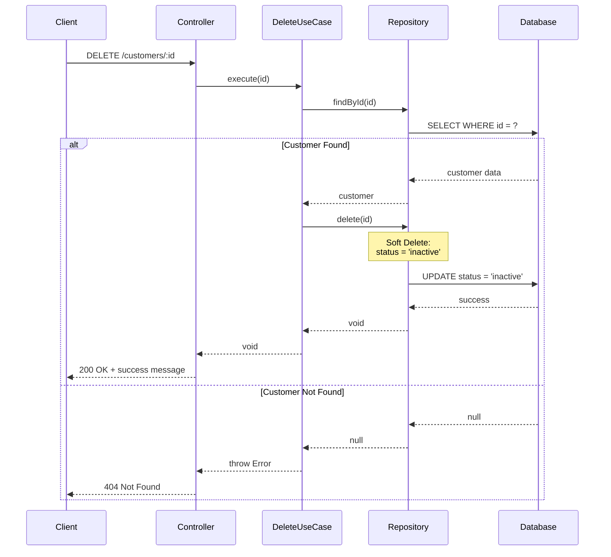

## 🤖 Agent Interaction - Sequence Diagram

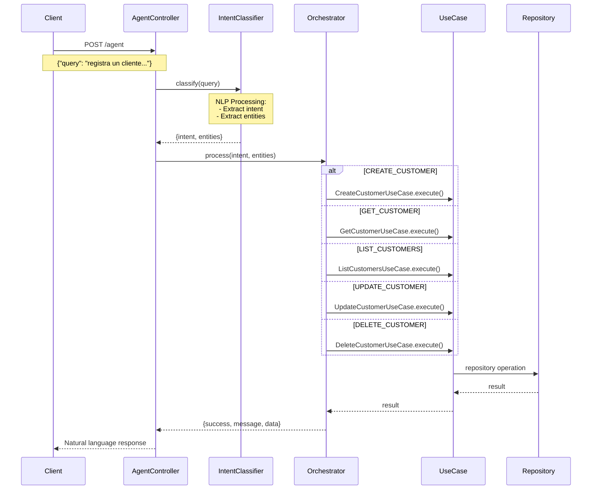

## 🔐 Security Flow

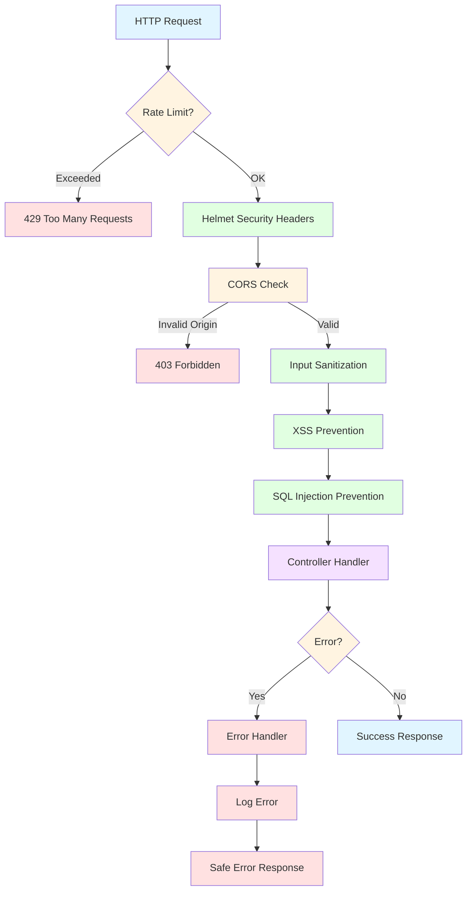

## 📦 Component Dependencies

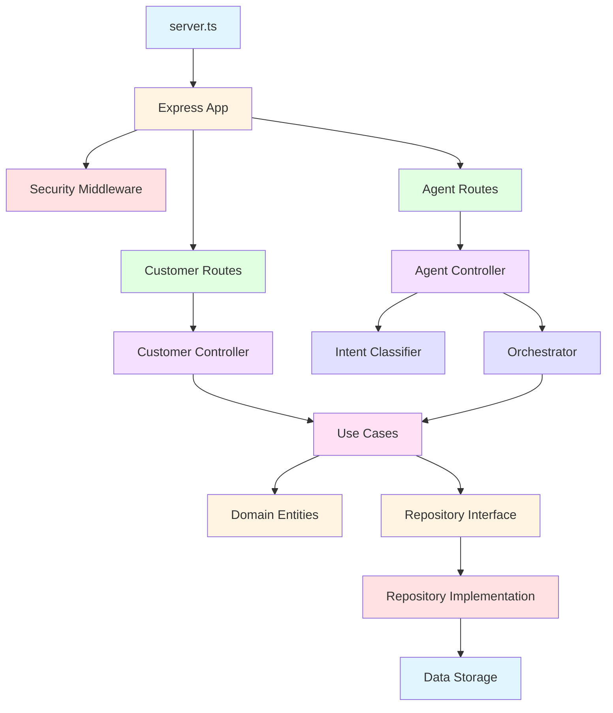

## 🎯 Use Case Dependencies

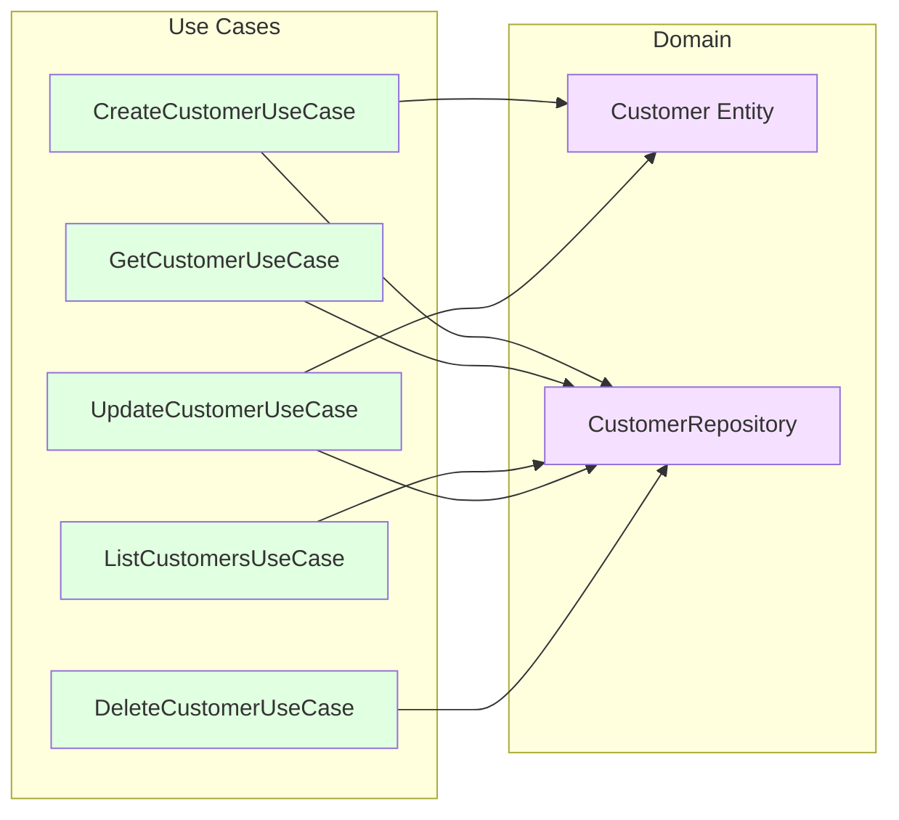

## 🧠 Agent Intelligence Flow

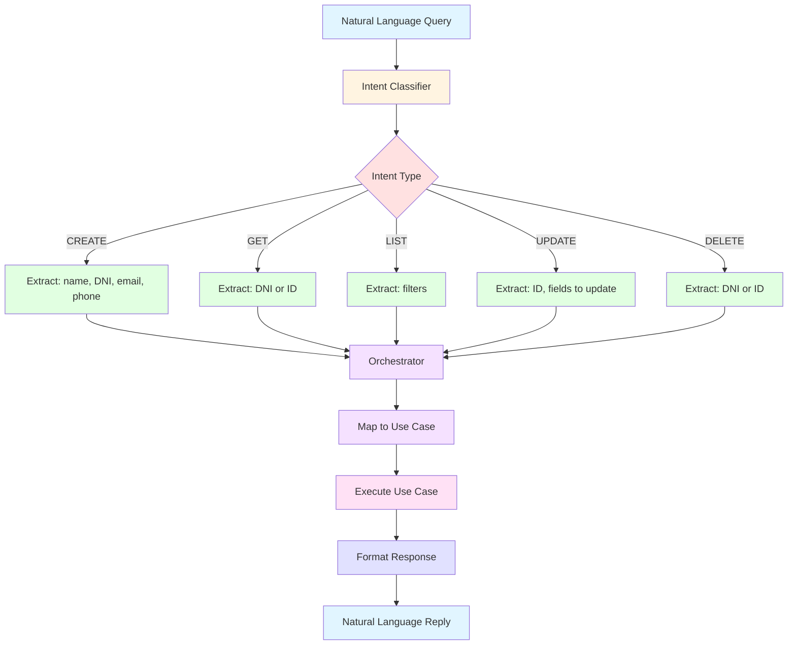

## 📝 Data Flow

```mermaid
graph LR
    A[Request] --> B[DTO]
    B --> C[Validation]
    C --> D[Use Case]
    D --> E[Domain Entity]
    E --> F[Repository]
    F --> G[Database]
    G --> F
    F --> D
    D --> H[Response DTO]
    H --> I[HTTP Response]
    
    style A fill:#e1f5ff
    style B fill:#fff4e1
    style C fill:#ffe1e1
    style D fill:#e1ffe1
